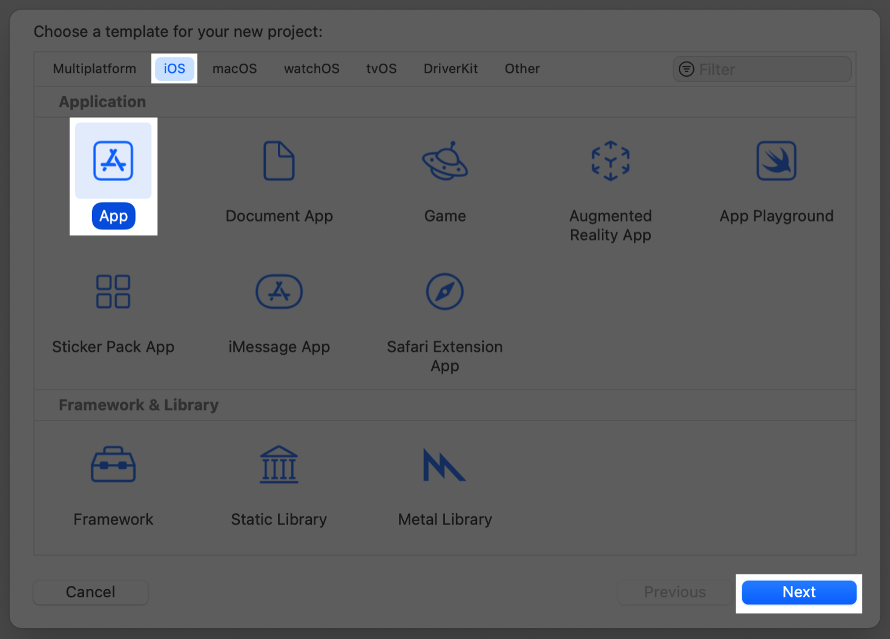

# !hero Creating and combining views

> !time 35mins

This tutorial guides you through building _Landmarks_ — an app for discovering and sharing the places you love. You’ll start by building the view that shows a landmark’s details.

To lay out the views, Landmarks uses _stacks_ to combine and layer the image and text view components. To add a map to the view, you’ll include a standard MapKit component. As you refine the view’s design, Xcode provides real-time feedback so you can see how those changes translate into code.

# !sections Create a new project and explore the canvas


Create a new Xcode project that uses SwiftUI. Explore the canvas, previews, and the SwiftUI template code.

To preview and interact with views from the canvas in Xcode, and to use all the latest features described throughout the tutorials, ensure your Mac is running macOS Sonoma or later.

## !steps

Open Xcode and either click “Create New Project” in Xcode’s startup window, or choose File > New > Project.


## !steps

In the template selector, select iOS as the platform, select the App template, and then click Next.



## !steps

Enter “Landmarks” as the product name, select “SwiftUI” for the interface and “Swift” for the language, and click Next. Choose a location to save the Landmarks project on your Mac.


## !steps

In the Project navigator, select `LandmarksApp`.

---

An app that uses the SwiftUI app life cycle has a structure that conforms to the `App` protocol. The structure’s `body` property returns one or more scenes, which in turn provide content for display. The `@main` attribute identifies the app’s entry point.

```swift LandmarksApp.swift
import SwiftUI

@main
struct LandmarksApp: App {
    var body: some Scene {
        WindowGroup {
            ContentView()
        }
    }
}
```

## !steps

In the Project navigator, select `ContentView`.

---

By default, SwiftUI view files declare a structure and a preview. The structure conforms to the `View` protocol and describes the view’s content and layout. The preview declaration creates a preview for that view.

```swift ContentView.swift
import SwiftUI

// !Mark(1:11)
struct ContentView: View {
    var body: some View {
        VStack {
            Image(systemName: "globe")
                .imageScale(.large)
                .foregroundStyle(.tint)
            Text("Hello, world!")
        }
        .padding()
    }
}

#Preview {
    ContentView()
}
```

## !steps

The Winds of Winter, the anticipated sixth book, is expected to continue the intricate storylines and bring new twists and turns to the world of Westeros. Fans eagerly await its release.

```js george.js
const houses = [
  "Stark",
  "Lannister",
  "Baratheon",
  "Targaryen",
  "Martell",
  "Tyrell",
  "Greyjoy",
]

const winterIsComing = () => {
  const isComing = Math.random() > 0.99
  if (isComing) {
    return "Winter is coming!"
  } else {
    return "Winter is not coming."
  }
}

console.log(winterIsComing())
```

## !steps

A Dream of Spring is the proposed final book in the series, anticipated to conclude the epic saga. It remains one of the most awaited books in modern fantasy literature.

```js george.js
const houses = [
  "Stark",
  "Lannister",
  "Baratheon",
  "Targaryen",
  "Martell",
  "Tyrell",
  "Greyjoy",
]

const keepDreaming = () => {
  return "Not gonna happen..."
}

console.log(keepDreaming())
```

# !sections Customize the text view

## !header

The first view you’ll build in this tutorial is a row for displaying details about each landmark. This row view stores information in a property for the landmark it displays, so that one view can display any landmark. Later, you’ll combine multiple rows into a list of landmarks.

## !steps A Game of Thrones

A Game of Thrones is the first book in the A Song of Ice and Fire series by George R.R. Martin. Set in a world where seasons last for years, it introduces a complex plot and a wide cast of characters, ranging from noble families vying for the Iron Throne to the supernatural threats in the North.

```js george.js
const houses = [
  "Stark",
  "Lannister",
  "Baratheon",
  "Targaryen",
]

const winner =
  houses[
    Math.floor(
      Math.random() * houses.length,
    )
  ]

console.log(`Iron Throne: ${winner}`)
```

## !steps A Clash of Kings

A Clash of Kings, the second book in the series, continues the epic saga. The Seven Kingdoms are plunged into war, with kings rising and falling. Meanwhile, Daenerys Targaryen seeks to return to Westeros with her growing dragons.

```js george.js
const houses = [
  "Stark",
  "Lannister",
  "Baratheon",
  "Targaryen",
]

const clash = () => {
  const winner =
    houses[
      Math.floor(
        Math.random() * houses.length,
      )
    ]
  return `${winner} wins the battle!`
}

console.log(clash())
```

## !steps A Storm of Swords

The third book, A Storm of Swords, is known for its intense and shocking developments. Battles rage on, alliances shift, and characters face unexpected challenges and betrayals, making it one of the most thrilling books in the series.

```js george.js
const houses = [
  "Stark",
  "Lannister",
  "Baratheon",
]

const reveal = () => {
  const traitor =
    houses[
      Math.floor(
        Math.random() * houses.length,
      )
    ]
  return `${traitor} betrays the alliance!`
}

console.log(reveal())
```

## !steps A Feast for Crows

A Feast for Crows, the fourth book, explores the aftermath of the wars, with a focus on the characters in the southern regions of Westeros. It delves into the politics and power struggles in a kingdom weary of battle.

```js george.js
const houses = [
  "Martell",
  "Lannister",
  "Baratheon",
  "Tyrell",
]

const intrigue = () => {
  const ally1 =
    houses[
      Math.floor(
        Math.random() * houses.length,
      )
    ]
  const ally2 =
    houses[
      Math.floor(
        Math.random() * houses.length,
      )
    ]
  return `${ally1} and ${ally2} form an alliance!`
}

console.log(intrigue())
```

## !steps A Dance with Dragons

A Dance with Dragons, the fifth book, runs concurrently with A Feast for Crows and focuses on the characters in the North and across the Narrow Sea. The story advances with dragons, the Night’s Watch, and the lingering threat of winter.

```js george.js
const houses = [
  "Stark",
  "Lannister",
  "Baratheon",
  "Targaryen",
]

const dragons = () => {
  const dragon =
    houses[
      Math.floor(
        Math.random() * houses.length,
      )
    ]
  return `${dragon} has a dragon!`
}

console.log(dragons())
```

## !steps The Winds of Winter

The Winds of Winter, the anticipated sixth book, is expected to continue the intricate storylines and bring new twists and turns to the world of Westeros. Fans eagerly await its release.

```js george.js
const houses = [
  "Stark",
  "Lannister",
  "Baratheon",
  "Targaryen",
  "Martell",
  "Tyrell",
  "Greyjoy",
]

const winterIsComing = () => {
  const isComing = Math.random() > 0.99
  if (isComing) {
    return "Winter is coming!"
  } else {
    return "Winter is not coming."
  }
}

console.log(winterIsComing())
```

## !steps A Dream of Spring

A Dream of Spring is the proposed final book in the series, anticipated to conclude the epic saga. It remains one of the most awaited books in modern fantasy literature.

```js george.js
const houses = [
  "Stark",
  "Lannister",
  "Baratheon",
  "Targaryen",
  "Martell",
  "Tyrell",
  "Greyjoy",
]

const keepDreaming = () => {
  return "Not gonna happen..."
}

console.log(keepDreaming())
```

# !sections Combine views using stacks

## !header

Beyond the title view you created in the previous section, you’ll add text views to contain details about the landmark, such as the name of the park and state it’s in.

When creating a SwiftUI view, you describe its content, layout, and behavior in the view’s `body` property; however, the `body` property only returns a single view. You can combine and embed multiple views in _stacks_, which group views together horizontally, vertically, or back-to-front.

In this section, you’ll use a vertical stack to place the title above a horizontal stack that contains details about the park.

## !steps A Game of Thrones

A Game of Thrones is the first book in the A Song of Ice and Fire series by George R.R. Martin. Set in a world where seasons last for years, it introduces a complex plot and a wide cast of characters, ranging from noble families vying for the Iron Throne to the supernatural threats in the North.

```js george.js
const houses = [
  "Stark",
  "Lannister",
  "Baratheon",
  "Targaryen",
]

const winner =
  houses[
    Math.floor(
      Math.random() * houses.length,
    )
  ]

console.log(`Iron Throne: ${winner}`)
```

## !steps A Clash of Kingsb

A Clash of Kings, the second book in the series, continues the epic saga. The Seven Kingdoms are plunged into war, with kings rising and falling. Meanwhile, Daenerys Targaryen seeks to return to Westeros with her growing dragons.

```js george.js
const houses = [
  "Stark",
  "Lannister",
  "Baratheon",
  "Targaryen",
]

const clash = () => {
  const winner =
    houses[
      Math.floor(
        Math.random() * houses.length,
      )
    ]
  return `${winner} wins the battle!`
}

console.log(clash())
```

## !steps A Storm of Swords

The third book, A Storm of Swords, is known for its intense and shocking developments. Battles rage on, alliances shift, and characters face unexpected challenges and betrayals, making it one of the most thrilling books in the series.

```js george.js
const houses = [
  "Stark",
  "Lannister",
  "Baratheon",
]

const reveal = () => {
  const traitor =
    houses[
      Math.floor(
        Math.random() * houses.length,
      )
    ]
  return `${traitor} betrays the alliance!`
}

console.log(reveal())
```

## !steps A Feast for Crows

A Feast for Crows, the fourth book, explores the aftermath of the wars, with a focus on the characters in the southern regions of Westeros. It delves into the politics and power struggles in a kingdom weary of battle.

```js george.js
const houses = [
  "Martell",
  "Lannister",
  "Baratheon",
  "Tyrell",
]

const intrigue = () => {
  const ally1 =
    houses[
      Math.floor(
        Math.random() * houses.length,
      )
    ]
  const ally2 =
    houses[
      Math.floor(
        Math.random() * houses.length,
      )
    ]
  return `${ally1} and ${ally2} form an alliance!`
}

console.log(intrigue())
```

## !steps A Dance with Dragons

A Dance with Dragons, the fifth book, runs concurrently with A Feast for Crows and focuses on the characters in the North and across the Narrow Sea. The story advances with dragons, the Night’s Watch, and the lingering threat of winter.

```js george.js
const houses = [
  "Stark",
  "Lannister",
  "Baratheon",
  "Targaryen",
]

const dragons = () => {
  const dragon =
    houses[
      Math.floor(
        Math.random() * houses.length,
      )
    ]
  return `${dragon} has a dragon!`
}

console.log(dragons())
```

## !steps The Winds of Winter

The Winds of Winter, the anticipated sixth book, is expected to continue the intricate storylines and bring new twists and turns to the world of Westeros. Fans eagerly await its release.

```js george.js
const houses = [
  "Stark",
  "Lannister",
  "Baratheon",
  "Targaryen",
  "Martell",
  "Tyrell",
  "Greyjoy",
]

const winterIsComing = () => {
  const isComing = Math.random() > 0.99
  if (isComing) {
    return "Winter is coming!"
  } else {
    return "Winter is not coming."
  }
}

console.log(winterIsComing())
```

## !steps A Dream of Spring

A Dream of Spring is the proposed final book in the series, anticipated to conclude the epic saga. It remains one of the most awaited books in modern fantasy literature.

```js george.js
const houses = [
  "Stark",
  "Lannister",
  "Baratheon",
  "Targaryen",
  "Martell",
  "Tyrell",
  "Greyjoy",
]

const keepDreaming = () => {
  return "Not gonna happen..."
}

console.log(keepDreaming())
```
